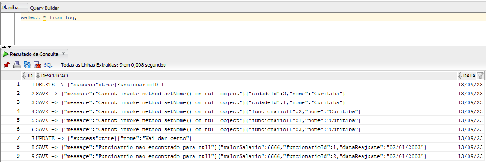

# API-REST-3
## **Descrição**

Este é um projeto de uma API desenvolvida em Groovy on Grails, ela direciona para os ENDPOINTS da API-2 salvando os registros em logs.

# **Pré-requisitos**
Antes de executar a API, certifique-se de ter o seguinte instalado em sua máquina:

* **[Grails](https://grails.org/download.html)** (versão 5.3.2 ou superior)
* **[Java Development Kit (JDK)](https://www.oracle.com/br/java/technologies/javase/javase8-archive-downloads.html)** (versão 8 ou 11)
* **[API-2](https://github.com/mfilipeamorim/API-2-Salarios)**
* **[API-3-PLUGIN](https://github.com/mfilipeamorim/API-3-Plugin)**

Set as variáveis de ambiente`GRAILS_HOME` apontando para o diretório de instalação do Grails.

Adicione `%GRAILS_HOME%\bin;%JAVA_HOME%\bin` ao final da variável PATH.
# Execução

Para executar a API localmente, use o seguinte comando pelo Prompt no caminho do projeto:

`grails run-app`

A API estará disponível em http://localhost:8081/API3.

# Endpoints

A API possui três domínios: Cidade, funcionario e ReajusteSalarial. Ambos possuem os mesmos endpoints configurados conforme abaixo.

- `GET API3/$controller/list` - Retorna a lista dos registros.
- `GET API3/$controller/{$id}` - Retorna os detalhes de um controller específico.
- `POST API3/$controller/save` - Cria um novo registro.
- `PUT API3/$controller/update{$id}` -  Atualiza os detalhes de um registro existente.
- `DELETE API3/$controller/{$id}` - Remove um registro.
# Armazenamento
Os dados são salvos no banco Oracle, dessa forma, criando a estrutura de tabelas quando iniciar a aplicação e excluíndo quando finaliza-la.

Configuração com o banco é configurada no `application.yml` conforme abaixo.


```
 environments:
    development:    
        dataSource:        
            driverClassName: 'oracle.jdbc.OracleDriver'
            username: 'ALUNO11'
            password: 'ALUNO11'
            dbCreate: create-drop
            url: "jdbc:oracle:thin:@insoft-lnx4.insoft.local:1521:desenv01"
```
# LOGS

Os logs são salvos na tabela LOG para as requisições `UPDATE`, `SAVE` e `DELETE`.

